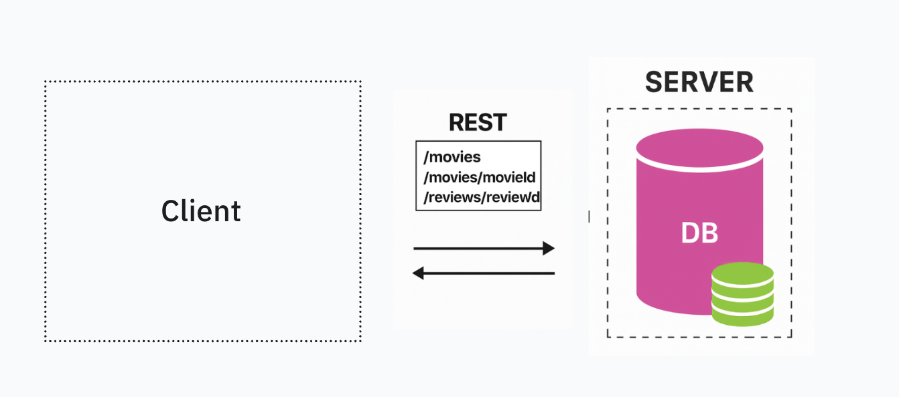
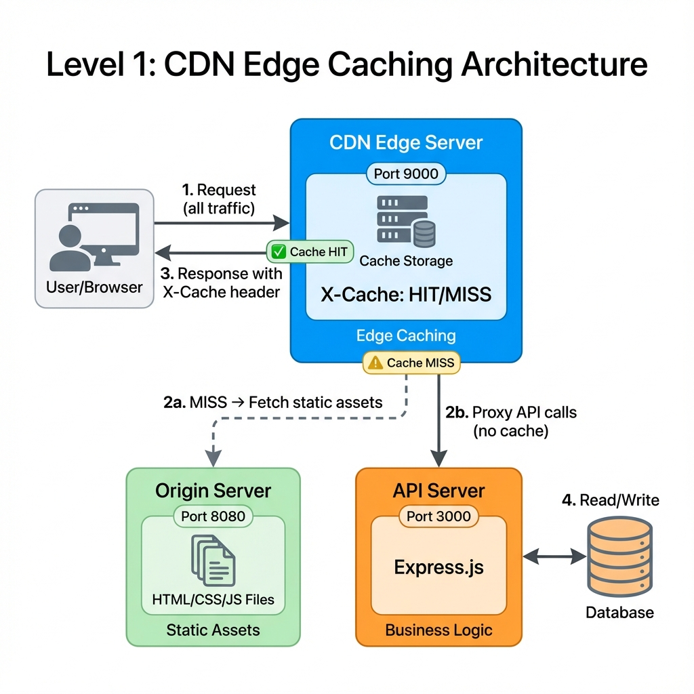

# Frontend System Design - Scale Levels

This repository demonstrates different levels of **frontend system design architecture**, showing how applications evolve from simple monolithic deployments to sophisticated, scalable systems.

## Architecture Levels

### [Level 0 – Plain Client–Server](level0/)



**Architecture**: A single Node/Express server serves HTML/CSS/JS, exposes JSON APIs, and talks to the database. Every user request terminates at this one box.

**Best for**:
- MVPs and prototypes
- Internal tools with limited users
- Early-stage products validating ideas
- Single-region deployments

**Limitations**:
- Single point of failure
- Limited scalability
- High latency for distant users

[→ View Level 0 Details](level0/)

---

### [Level 1 – Separated Frontend & Backend](level1/)



**Architecture**: Static frontend (HTML/CSS/JS) served from a CDN or static host, while the API runs on a separate backend server. CORS-enabled communication between services.

**Best for**:
- Global user base
- Apps needing independent frontend/backend scaling
- Teams wanting separate deployment pipelines
- Improved static asset delivery via CDN

**Benefits**:
- Better performance with CDN edge caching
- Independent scaling of frontend and backend
- Reduced backend load
- Faster global delivery

**Added complexity**:
- CORS configuration required
- Two separate deployments
- Environment-specific API URLs

[→ View Level 1 Details](level1/)

---

## Coming Soon

- **Level 2**: Server-Side Rendering (SSR) with frameworks like Next.js
- **Level 3**: Advanced caching with Redis and edge computing
- **Level 4**: Microservices architecture with API gateways
- **Level 5**: Distributed systems with event-driven architecture

## Learning Path

Start with **Level 0** to understand the basics, then progress through each level as your requirements grow:

1. **Level 0** → Simple monolith for getting started
2. **Level 1** → Add CDN when you have global users or need independent scaling
3. **Level 2+** → Add SSR, state management, and advanced caching as complexity grows

## Running the Examples

Each level has its own directory with a complete cinema booking app example:

```bash
# Level 0 - Single server
cd level0/cinema-app
npm install && npm start

# Level 1 - Separated services (requires two terminals)
# Terminal 1: API server
cd level1/cinema-app/api
npm install && npm start

# Terminal 2: Frontend server
cd level1/cinema-app/web
npm install && npm start
```

## Contributing

This is an educational resource. Feel free to suggest improvements or additional architecture levels!

## License

MIT
